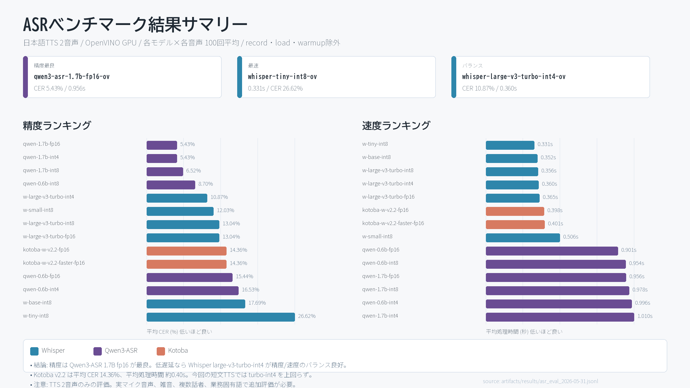

# asr_benchmark

CLI benchmark for microphone ASR inference with Whisper OpenVINO IR models from
the OpenVINO Speech-to-Text collection on Hugging Face.

## Benchmark Summary



Detailed results are in
[`reports/asr_model_evaluation_2026-05-31.md`](reports/asr_model_evaluation_2026-05-31.md).

## Setup

```powershell
uv sync
```

All examples below use `uv run`, so the CLI can run from the local project
without installing `asr-bench` onto your global `PATH`.

If you want to install the command into the active Python environment:

```powershell
pip install -e .
```

## Prepare Models

Downloads OpenVINO's pre-converted default Whisper models from Hugging Face:
`whisper-tiny-int8-ov`, `whisper-base-int8-ov`, `whisper-small-int8-ov`, and
the `whisper-large-*` variants for `large-v3` and `large-v3-turbo`.

```powershell
uv run asr-bench prepare
```

This prepares every model required by the default `record` command:

```powershell
uv run asr-bench record --seconds 10 --exclude-record-load --exclude-warmup
```

You can download selected sizes:

```powershell
uv run asr-bench prepare --size tiny --size base
```

If you only prepared `tiny` and `base`, pass those model directories explicitly
when recording. The default `record` command expects all default models,
including the `whisper-large-*` models.

```powershell
uv run asr-bench record --seconds 5 `
  --model ./models/whisper-tiny-int8-ov `
  --model ./models/whisper-base-int8-ov
```

Use another precision from the collection:

```powershell
uv run asr-bench prepare --size tiny --size base --precision fp16
```

Download an exact model id:

```powershell
uv run asr-bench prepare --model-id OpenVINO/whisper-large-v3-turbo-int4-ov
```

Download every `OpenVINO/whisper-*` model listed in the collection:

```powershell
uv run asr-bench prepare --all-whisper
```

## List Microphones

```powershell
uv run asr-bench devices
```

## Run Benchmark

Records the microphone once into memory, then runs the same audio through each model.

```powershell
uv run asr-bench record --seconds 5
```

By default, `record` uses:

- models: `./models/whisper-tiny-int8-ov`, `./models/whisper-base-int8-ov`, `./models/whisper-small-int8-ov`
- large models: `./models/whisper-large-v3-turbo-int4-ov`, `./models/whisper-large-v3-turbo-int8-ov`, `./models/whisper-large-v3-turbo-fp16-ov`, `./models/whisper-large-v3-int4-ov`, `./models/whisper-large-v3-int8-ov`, `./models/whisper-large-v3-fp16-ov`
- OpenVINO device: `GPU`
- language: `ja`
- task: `transcribe`
- audio: 16 kHz, mono, float32, in memory

The default model set is large. For a quick benchmark, pass only the model
directories you want with `--model`.

Example with explicit models:

```powershell
uv run asr-bench record --seconds 5 `
  --model ./models/whisper-tiny-int8-ov `
  --model ./models/whisper-base-int8-ov
```

Example output:

```text
model=whisper-tiny-int8-ov device=GPU language=ja task=transcribe total_scope=all record=5.012s load=2.301s warmup=0.000s preprocess=0.042s infer=0.821s decode=0.004s total=8.180s text="こんにちは"
```

By default, `total` includes recording, model loading, warmup, preprocessing,
inference, and decoding. To compare only model-side processing time, exclude
recording, loading, and warmup:

```powershell
uv run asr-bench record --seconds 5 --exclude-record-load --exclude-warmup
```

You can also use only one of those options when needed.

JSON Lines output:

```powershell
uv run asr-bench record --seconds 5 --jsonl
```

Use another OpenVINO device:

```powershell
uv run asr-bench record --seconds 5 --device CPU
```

Use a specific microphone:

```powershell
uv run asr-bench record --seconds 5 --input-device 1
```

## Qwen3-ASR OpenVINO

Qwen3-ASR uses a different architecture from Whisper, so it has separate
commands. The conversion path follows the OpenVINO Qwen3-ASR notebook helper.

Convert both Qwen3-ASR models to `fp16`, `int8`, and `int4` IR directories:

```powershell
uv run asr-bench prepare-qwen
```

This creates:

```text
models/qwen3-asr-0.6b-fp16-ov
models/qwen3-asr-0.6b-int8-ov
models/qwen3-asr-0.6b-int4-ov
models/qwen3-asr-1.7b-fp16-ov
models/qwen3-asr-1.7b-int8-ov
models/qwen3-asr-1.7b-int4-ov
```

Convert only one model or precision:

```powershell
uv run asr-bench prepare-qwen --model-id Qwen/Qwen3-ASR-0.6B --precision fp16
```

Benchmark converted Qwen3-ASR models with the same recorded audio:

```powershell
uv run asr-bench record-qwen --seconds 10 --exclude-record-load --exclude-warmup `
  --model ./models/qwen3-asr-0.6b-fp16-ov `
  --model ./models/qwen3-asr-0.6b-int8-ov `
  --model ./models/qwen3-asr-0.6b-int4-ov
```

If `--model` is omitted, `record-qwen` expects all six default Qwen3-ASR
directories listed above. Qwen3-ASR accepts language names; common codes such
as `ja`, `en`, and `zh` are mapped to `Japanese`, `English`, and `Chinese`.

## Kotoba Whisper v2.2 OpenVINO

`RoachLin/kotoba-whisper-v2.2-faster` is a CTranslate2/faster-whisper export.
OpenVINO IR is exported from its Hugging Face `base_model`,
`kotoba-tech/kotoba-whisper-v2.2`, and saved under the faster-whisper model
name so it is easy to compare.

Convert the default Kotoba model to FP16 OpenVINO IR:

```powershell
uv run asr-bench prepare-kotoba
```

This creates:

```text
models/kotoba-whisper-v2.2-faster-fp16-ov
models/kotoba-whisper-v2.2-fp16-ov
```

Convert FP32 and FP16 variants:

```powershell
uv run asr-bench prepare-kotoba --precision fp32 --precision fp16
```

Benchmark the converted Kotoba model with the normal Whisper `record` command:

```powershell
uv run asr-bench record --seconds 10 --exclude-record-load --exclude-warmup `
  --model ./models/kotoba-whisper-v2.2-faster-fp16-ov `
  --model ./models/kotoba-whisper-v2.2-fp16-ov
```

If the faster-whisper model card changes, you can pin the source explicitly:

```powershell
uv run asr-bench prepare-kotoba `
  --faster-model-id RoachLin/kotoba-whisper-v2.2-faster `
  --source-model-id kotoba-tech/kotoba-whisper-v2.2
```
